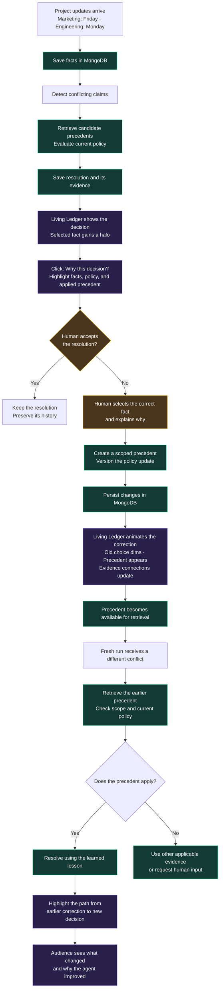

# Chronicle demo flow

The [user decision log](decisions.md) records how this design evolved. The current answer-first/replay flow supersedes automatic zooming on submission; the natural memo review supersedes an opening prompt that explicitly supplies both conflicting claims.

## One view, two presentation lengths

**First round: 60 seconds total, targeting about 15 seconds of chat followed by roughly 45 seconds of visualization. If the team reaches the top six: a five-minute demo.** These are the user's presentation requirements. Both use the same terminal, optional spatial replay, scenario, and underlying state. There is no short/long mode switch or second walkthrough.

After optional internal replay reveals the surrounding network, the scene keeps the core results and their relationship understandable: **initial decision → human correction and scoped lesson → improved decision on a different conflict in a fresh run.** Processes are represented compactly. Narration carries technical detail; optional inspections expose evidence and integrations when time allows.

The longer presentation gives the same story room to breathe. It can inspect evidence, discuss the stored lesson, and show the out-of-scope case without making those inspections prerequisites for understanding the one-minute demo. Full product scope and correctness checks remain unchanged.

## Main view and optional depth

- **Normal use:** plain Chronicle wordmark and a practical floating terminal that fills the available window between compact header/footer bars, with consistent padding, fixed 14px conversation text, named source selection, adjacent company/model dropdowns, scrolling Markdown conversation, and a prompt composer. No logo is defined; do not substitute a provider-like star symbol.
- **Conversation controls:** a compact chat picker and New chat create real browser-persisted conversations. Transcripts and model conversation history stay scoped to the selected chat; project facts, corrections, and policy remain shared. Older history migrates into the first chat. Switching preserves unsent text and attachments during the session. The toolbar sits below the typing area, with company/model dropdowns aligned right and the paperclip before From and the person’s name on the left; Use example memo sits beside Reset demo. Hide provider/model names and “Local rules” in reply metadata. Show “✓ Decision saved to memory” only for a completed turn with a recorded decision-save confirmation; during replay reveal it only once that confirmation is reached. Pending replies and failed saves must not show this status. The decision-save badge is reserved for explicit saved human answers/corrections (including leave-unresolved) and automatic conflict resolutions that apply a scoped lesson. Ordinary replies, greetings, acknowledgements, fact ingestion/lookups, and provisional choices awaiting review must not receive a decision badge merely because the conversation was persisted. Keep provider selection and technical replay inspection available. Omit keyboard hints. Use a subtle contrast increase for text, borders, and controls without changing the dark green palette. Textareas grow and shrink with their contents without resize handles, and scroll after a bounded height.
- **Start with a natural review:** Maya [Marketing] attaches a go-to-market memo and asks “Can you review this before I share it with the team?” The draft contains messaging, campaign assets, rollout details, and a Friday launch date. Chronicle notices that date while reviewing the full document, compares it with a readiness update from Alex [Engineering] learned earlier, and raises the discrepancy without requiring the user to name it. The Engineering source is dated September 18 in the example and expects Monday readiness. Example documents and seeded records remain identifiable.
- **Natural follow-up:** after the correction, attach Maya’s next-release brief for review. Its Tuesday announcement meets Alex’s separately seeded Thursday readiness gate from September 24 planning notes. The user never supplies both competing claims. Maya and Alex are fictional example teammates, with authors stored separately from department authority keys. Existing saved sessions retain their history; reset the local example to load the updated seed set.
- **Formatting and model selection:** render standard Markdown and GFM (bold, italics, lists, code, links, tables) in messages, including existing saved history and replay. Ignore raw HTML and remote image embeds. Company choices filter the model dropdown; OpenAI includes signed-in Codex and the API-key route, while Anthropic and Custom retain their connection settings. Switching companies remembers the prior model for that company during the session.
- **Repeated corrections and attribution:** Human conflict answers use the currently selected composer identity (for example Maya [Marketing]), separately from the selected fact’s author; never hardcode “You” or relabel old anonymous records. An explicit conflicting revision of an already decided subject (for example “actually the launch should be October 2”) saves the new claim and opens a fresh source-of-truth question even when a prior lesson applies. Calendar-only launch dates are supported. Keep the prior decision and policy history; save the new scoped choice only after an explicit answer. Simple lookups use the latest saved human answer without treating old disagreement as a new unresolved question.
- **Adaptive question eligibility:** Conflict questions adapt to the current request and its relevant recorded claims. Start chats and resets with an empty composer; load the demo document only through Use example memo. Automatically prompt only for the latest response in the active chat, never an older unanswered conflict after an unrelated reply. The constrained model review proposes claims and relationships; questions are built from validated, relevant evidence groups after the engine runs. Unrelated requests get no question. Multiple conflicts in one response queue one question at a time with stable conflict IDs, and each answer saves independently without adding question messages to the transcript. Keep claim/source options grounded in stored evidence, retain manual reopening on the original response, and do not ask again when a saved human answer covers the same facts or a scoped lesson was applied. The default connected reviewer extracts date, owner, budget, status, and access-level claims with exact source passages; the Python engine decides among validated stored candidates. The reviewer is bounded to 80 stored facts and eight new claims, not unlimited semantic memory.
- **Direct conflict question:** once the current response requests a grounded conflict decision, temporarily replace the composer with a compact question card. Keep the existing draft text, attachments, and source cached; restore them unchanged after answering or skipping. It uses concise claim/source options, an always-visible Add context textbox, and an explicit Submit answer. Show context files sits above the options and opens an evidence panel upward without shifting the options. The context textbox grows with its text and is not hidden behind a dropdown. Keep navigation usable and return the normal composer afterward: no modal, backdrop, focus trap, or forced focus. No claim is preselected. Include Leave unresolved and Skip for now; deferring keeps a Resolve conflict action on that response. Persist the human answer linked to the original conflict and retain the old decision. A clearly labeled, initially unchecked checkbox can remember any recorded claimant source’s authority for the displayed scope in this project. Stored evidence constrains the scope and attribute; generic scopes narrow to subject and attribute. Without that explicit opt-in, a selection or leave-unresolved answer applies only to that conflict. Human answers use the backend correction API without another model request. Completed answers survive reload; only the latest eligible unanswered response can prompt on reload; older questions stay on their original response. Replay never triggers a question.
- **Immediate send:** the submitted text and attachments appear in history and the composer clears before generation. A separate Chronicle reply indicator shows the wait and elapsed time; it never claims a completed or saved answer. The composer and attachment controls remain editable while the reply is pending, so the user can prepare the next message; sending another request waits for completion. Never clear that next draft when generation finishes. On failure, retain the recorded message and restore the submitted draft only if there is no newer text or attachment draft. Otherwise preserve the newer draft and leave the failed message in history.
- **Answer first:** the selected model returns the response while the terminal remains large and stationary. Do not force an animated presentation on each prompt.
- **Optional internal replay:** Show a single Replay internals action for the latest completed cycle in the active chat. A conflict cycle requiring human input is complete only after every queued conflict has a saved human answer (including an explicit leave-unresolved answer); combine the original review and all linked correction traces into that one replay. Pending, failed, incomplete-memory-check, and deferred conflict cycles have no replay action. The person selector contains only Maya [Marketing] and Alex [Engineering]. Do not show a “Review the next release brief” suggestion button; follow-up documents can still be attached normally. Replay zooms out and plays the combined recorded events without generating another answer or repeating writes. Pause, step, and return-to-terminal controls remain available.
- **Visible saves:** distinguish writing from write confirmation, and preserve the distinction between fact persistence and final decision/evidence persistence. Failed writes are not shown as saved.
- **Optional depth:** scoped policy, old facts, selected evidence, response history, and model/provider details live in the same terminal and revealed scene. No separate short/long presentation mode.

## Optional reported-source regression walkthrough

The natural document review remains the presentation scenario. To verify reported-source input separately:

1. Send “Marketing says the launch is Friday. Engineering says the launch is Monday.” Both departments should remain distinct, with Maya recorded as submitter rather than as the Engineering claimant. Starting policy provisionally chooses Friday.
2. Use the conflict card directly, or choose **Skip for now** to return to the composer and send “Engineering owns launch readiness for this project.” That statement reopens the recorded evidence with its wording in **Add context**. Select **Monday / Engineering**, explicitly check **Remember authority**, and submit. Only this answer saves the correction, precedent and policy v2.
3. Send “Marketing says the next release is Wednesday. Engineering says Thursday.” If both claims validate and the new precedent is retrieval-ready, Thursday should be selected automatically with that precedent ID. If shorthand cannot be validated, the reply must show the omitted passage and ask for clarification instead of implying a complete check.
4. Use **Replay internals → Resolution engine** to inspect the supporting facts, applied precedent, and policy. The ownership-statement turn has no replay action until its explicit answer is saved.

## User-directed spatial architecture

The terminal initially fills the available window with 20px side gutters (12px on small screens), a 52px header, and a compact status footer. Working-view typography does not grow with window dimensions; only the optional spatial replay scales. Submitting a prompt does **not** move the camera. The explicit replay button pulls back until the terminal occupies approximately one fifth of the visible scene; the overview keeps destinations clustered nearby with complete paths in view. Directed close views may frame only the active service and its immediate connections.

The replay uses one shared perspective camera and three depth layers: the foreground conversation, resolution/model execution, and persistent memory/retrieval underneath. After the presenter selects **Replay internals**, playback directs itself: the camera eases toward the relevant service, turns to reveal two underlying process sheets, holds across consecutive steps at the same service, and ends by flattening the shared scene before zooming the same terminal back to its working layout. The reference image informs the stacked-layer metaphor only; Chronicle is not showing a neural-network pipeline or private model reasoning. An unscaled **input → operation → output** caption explains each transformation while a teammate narrates. Pause, scrubbing, and **Replay step** remain available; Replay step restarts the selected visual beat and pauses there, including on the final event. Full autoplay returns to the terminal. Automatic camera following is the default, with no Auto camera/Explore camera selector. Drag exploration is secondary, and pressing Play restores the automatic camera and clears the manual pan. Depth is enabled by default without a user-facing toggle. System reduced-motion preferences remove perspective and skip the animated return. Cards and connection endpoints share world coordinates so camera movement cannot detach the wires. Service inspection pauses playback and opens unscaled details. Desktop demo rendering is the validation target; mobile support and mobile checks are not required. A larger 3D renderer is not installed.

The service stations show actual recorded operations. Atlas stores workspace snapshots (documents, facts, conversation, engine resolutions, corrections, policy history and replay traces) plus precedent embeddings in the separate `precedents` collection. Voyage embeds conflict queries and correction documents through Danny’s module; Atlas Vector Search returns project-filtered candidates and measured similarity scores. Elmir’s Python engine checks applicability and policy before selecting evidence. Only backend-confirmed operations mark those services as called. Service inspection accumulates receipts across the complete review/correction cycle, so entering the human-answer phase does not erase the earlier search. Receipts remain gated by packet arrival and disappear when scrubbing before their event. No-call explanations distinguish older browser-only recordings, reuse of a saved human answer, and recorded retrieval failure; ordinary messages do not need precedent retrieval. The model proposes claims and conflict relationships before resolution; validation/grouping happens locally and provenance is checked again at persistence. Those events must not impersonate engine decisions. The fallback browser parser and legacy traces retain their local meaning. No score, embedding, storage acknowledgment or route is inferred from the presence of a conflict. Receipts expose model, dimensions, input type, duration, candidate IDs/scores/scope, selected fact, applied precedent and policy changes. MongoDB Agent Skills/MCP remain development tools.

Service semantics checked against the [Voyage embedding documentation](https://docs.voyageai.com/docs/embeddings), [Atlas Vector Search query documentation](https://www.mongodb.com/docs/atlas/atlas-vector-search/vector-search-stage/), and [MongoDB MCP overview](https://www.mongodb.com/docs/mcp-server/overview/). The supplied planning document controls the team’s integration responsibilities.

Replay follows the actual recorded application sequence:

1. Receive Marketing’s review request and attached memo.
2. Save the original message/document, filename, and source; confirm the write.
3. Send the review request, document and bounded stored context to the selected model once. Receive provisional review prose plus proposed typed claims and semantic relationships in `memoryAnalysis`; the model has no resolution authority.
4. Validate exact quotes, source references, stored fact IDs and typed compatibility. Save accepted facts with their original-source provenance. If analysis is unavailable, say so without inventing claims or conflicts.
5. Group relevant evidence by subject, attribute, scope and overlapping period, respecting currency/date comparability. For each conflict, retrieve candidates once through Danny’s module and let Elmir’s engine check applicability and policy.
6. Append the authoritative engine or saved-human-answer summary to the review, with source-backed question groups where human input is required.
7. Save the response, explanations and evidence; confirm the write.
8. Return the review to the stationary terminal. Queue multiple questions within this response; save each explicit answer independently. One combined replay becomes available after all required answers are saved. Replay never repeats these operations.

Glowing packets travel between the corresponding stations. Saving has its own route and confirmation; it must not be collapsed into an unexplained “memory” pulse. Base transfers use the original one-second route pace. For recordings exceeding the 45-second autoplay budget, the shared playback clock accelerates all motion proportionally; shorter recordings and Replay step retain the base pace. On arrival, one dot descends through the service layers and rises back to the surface over at least 1.92 seconds (1.25× the original bounce speed). Consecutive service operations and save confirmations retain their own captions while continuing that same round trip at its current position. The next transfer starts as the ascent finishes, without an idle hold or duplicate pass. Use one persistent dot across wire and stack phases. Teleport from the wire endpoint to a fixed stack corner, bounce down and back up that lane, and teleport onto the next route without a diagonal connecting flight. Each 250 ms teleport beat fades out for 125 ms, changes position at zero opacity, and fades back in for 125 ms. There is no visibly frozen hold; this is presentation timing, not a fabricated service event. The camera preserves velocity across changing service destinations, with a steadier angle and gentler zoom. Horizontal camera tilt is reduced by 25%: overview yaw −9°, service yaw −16.5°, and optional drag yaw ±4.5°; vertical tilt is unchanged. Teleports and caption changes do not restart camera motion. Flattening back into the terminal also eases gradually. Only one incoming connection carries the moving dot; other context connections can remain highlighted. Pause/resume, scrub, and Replay step retain the relevant slice of this shared motion timeline. Drive packet motion and step advancement from one playback clock; caption changes must not restart the first part of a transfer or bounce. Combine a write request, backend receipt, and confirmation into one visible save step while retaining their original events and order. Keep one bounce across consecutive operations at a service. Local terminal captions continue the incoming transfer without an in-chat bounce, processing delay, or camera return; retain the last service camera until the next service, then flatten back into the terminal at the end. Use the same layer offsets for packet motion and sheet depth, with only 2 px clearance outside the sheet edge. Turn the bounce slightly before the lowest sheet (80% of the full descent) so the packet glow does not visibly overshoot. Run the service-stack bounce at 1.25× its original speed (2.4 s becomes 1.92 s), retaining the one-second transfers and 250 ms teleport fades. Derive each visible connection from the preceding and destination stations; route the engine-to-Voyage connection around the model card. Keep the dot outside sheet edges so upper layers cannot hide it. Reveal service results when the packet arrives, and the answer when replay returns it. Identify older browser-only recordings and explain that a new conflict is needed to capture connected Voyage calls. Replay preserves recorded event order and timestamps; it is not live provider latency or a view into private model reasoning. New model calls capture a credential-free request receipt at the server boundary: prompt, attachment names and sizes, history references, fact/note IDs, policy version, selected evidence, provider, model, and transport. Replay shows the returned character count and measured duration. Older turns say when their request details were not captured; do not reconstruct them from current memory. Future backend events must supply their actual service, operation, input/output summaries, and evidence, using the agreed integration contract.

New prompts can be arbitrary text. One constrained real-model task supplies provisional review prose and structured evidence proposals for date, owner, budget, status and access levels. Exact quotes and referenced IDs must validate before facts are saved; semantic proposals do not select authorities or mutate policy. The Python engine decides conflicts using Atlas-backed policy and Danny’s retrieval. The reviewer has bounded context and conservative type/date checks; this does not establish reliable interpretation of every document or all project history. Exact saved-human-answer lookups avoid another model call. The implementation used a coding subagent for semantic conflict work; the application does not launch a second autonomous runtime agent.

The user authorized Codex through their existing sign-in for the demo, plus a provider/model selector and API-key connections for OpenAI, Claude, and compatible providers. Keys stay only in the local server's memory. Actual service status distinguishes recorded provider calls, Atlas acknowledgments, backend-memory fallback when no URI is configured, and services not called in that turn.

## Measured one-minute sequence

The first-round order is **send the example memo → answer the conflict as soon as it appears → wait for the saved decision → Replay internals**. End the minute after the combined review/correction replay returns to the terminal. Later-conflict reuse remains in the five-minute extension and full MVP checks; it is not an event in this short recording. Keep one shared view and the existing service-by-service replay.

Before starting the clock, connect the backend, use a fresh demo workspace, select Maya and Luna · Fast, and load **Use example memo**. Start timing when Send is pressed. At the question, select **Monday, October 5th / Alex [Engineering]**, check **Remember Engineering’s authority for launch readiness in this project**, and submit. Skip typing optional context for this rehearsal. The checkbox is required to demonstrate reusable learning; an ordinary selection saves only that conflict's answer. Start replay immediately when available. Setup/loading the example is excluded from these measurements; include it separately if it must appear in the submitted video.

### Live measurements — September 26, 2026

Two successful real-service rehearsals used the same example memo, Codex Luna, Atlas, Voyage, and the Python engine. The first exercised the browser and complete autoplay. The second timed the same application orchestration and HTTP paths in a separate QA workspace, including the final trace persistence. Both saved policy v2 and confirmed actual indexed retrieval readiness. These are two samples, not a latency guarantee or a continuously performed human one-minute take. Browser inspection pauses between actions are excluded from the projected total; the presenter click allowance below is estimated.

| Segment | Observed time | What happens |
| --- | ---: | --- |
| Send memo → completed review | First run: 8.184 s recorded processing, excluding final trace save; second: **9.272 s end to end** | Preserve original memo; run one constrained review; validate and save claims; compare with stored Engineering evidence; retrieve precedents; apply policy v1; retain response and trace. |
| Select Engineering, check Remember authority, submit | **Budget 2–3 s**, not measured human reaction time | Explicit human choice and permission to remember scoped authority. |
| Submit answer → completed correction | First: **3.121 s** browser click-to-replay-availability; second: **2.763 s** end to end | Save linked correction, embed/store precedent, verify search readiness, version policy, save answer/evidence and completed trace. No second model request. |
| Click Replay internals | **Budget 0.3 s**, not measured human reaction time | Start a read-only recording of the just-completed cycle. |
| Replay → working terminal | **45.438 s measured in browser**; 45.000 s calculated | 39 saved events in 29 visible steps; includes flattening and final zoom. No new model/service work. |

Using the second run's complete live timings and the measured browser replay, machine-controlled segments total **57.473 s**. Exactly 60 seconds leaves **2.527 s for selection, checkbox, Submit, and Replay clicks combined**. With a 2–3 s answer interaction plus a 0.3 s replay click, project **59.8–60.8 seconds**. The current flow can land around one minute, but is not yet a reliable strict 60-second live take. For a strict submission, rehearse a successful take with the memo preloaded and replay starting by about **0:14.5**. If using a captured successful run, identify it as recorded. Do not imply the service timings are guaranteed or show a save before it completes.

The second run's live review breakdown was: original memo save **0.183 s**; model request **7.986 s**; accepted fact save **0.206 s**; retrieval/engine resolution **0.524 s**; response save **0.182 s**; completed trace save **0.181 s**; remaining local work/rounding about **0.010 s**. Correction: backend correction including embedding, indexing readiness and policy commit **2.012 s**; answer save **0.288 s**; decision/evidence save **0.271 s**; trace save **0.190 s**. These sequential request measurements can be added; engine service receipts can contain nested retrieval time and must not be added again.

### Faster review follow-up

The subsequent latency change keeps the same Luna model, one request, full source documents, complete claim quotes and existing validators. It asks for compact JSON and **one brief, quote-grounded document-quality comment by default** (up to two when detail is requested). Short source fragments support these optional comments only; claim provenance still requires the full supporting sentence. Translation, summary and rewrite requests still receive their requested output. Unsupported metadata, time-only values and requests for an unassigned owner must not become proposed project claims.

In an alternating model-only comparison, the previous prompt took **10.053 s** (partial analysis) and **8.782 s** (validated); the initial shorter prompt took **5.698 s** and **6.533 s**, both validated. One subsequent full run took 9.307 s in the model and rejected two extra claims, so it was not accepted as a successful optimization measurement. After clarifying unsupported proposals, the complete real-service check took **5.994 s in the model**, **7.542 s Send-to-completed-review**, and **1.952 s for the correction**, with validated evidence, policy v2 and retrieval readiness confirmed. These are small samples; the faster correction is service/index variation, not a model-prompt speedup.

With the unchanged previously measured 45.438 s replay and a 2.3–3.3 s presenter click allowance, that successful final run projects **57.2–58.2 seconds overall**. Rehearse with the visible question and service cues; do not wait artificially to reach the old 0:09/0:14.5 cues. The earlier tables remain the original baseline measurement, not a claim of current fixed latency. See [latency evidence](sources/demo-latency-2026-09-26.json). The approach follows [OpenAI's output-reduction guidance](https://developers.openai.com/api/docs/guides/latency-optimization); measured results above, not that general guidance, establish this app's observed improvement.

### Replay narration clock

Times below start at **Replay internals**, independently of live response latency. Boundaries are calculated from this saved cycle and the actual playback code; the total was also checked in the browser. Frame timing added approximately 0.44 s across the complete replay, so narrate to service/caption cues instead of promising each boundary to the tenth of a second. The model's roughly 8-second live response is represented by a shorter visual step; animation duration is not backend execution time.

| Replay time | Duration | Visible segment and meaning |
| --- | ---: | --- |
| 0:00.0–0:02.7 | 2.7 s | Receive Maya's request; Atlas preserves the original memo and author before extracting claims. |
| 0:02.7–0:05.8 | 3.2 s | Model reviews the memo and proposes claims; local validation checks the evidence. The model does not determine authority. |
| 0:05.8–0:11.3 | 5.5 s | Save Marketing's Friday claim; recall Alex's September 18 Monday update; detect disagreement and read stored facts/policy. |
| 0:11.3–0:13.6 | 2.3 s | Engine receives the validated conflicting evidence; orchestration prepares retrieval. |
| 0:13.6–0:18.3 | 4.6 s | Voyage embeds the conflict query; Atlas Vector Search looks for project-scoped lessons. This fresh workspace returned **zero committed candidates**. |
| 0:18.3–0:26.9 | 8.7 s | Python applies policy v1, provisionally favors Marketing's Friday, and saves the original resolution, review response and evidence. |
| 0:26.9–0:29.8 | 2.8 s | Replay reaches the human answer; the engine converts the explicit authority choice into a scoped precedent and proposes policy v2. |
| 0:29.8–0:34.4 | 4.6 s | Voyage embeds the lesson; Atlas stores its vector. |
| 0:34.4–0:36.7 | 2.3 s | Vector Search checks that the new precedent is actually retrievable. This is readiness verification, not reuse on a different conflict. |
| 0:36.7–0:39.0 | 2.3 s | Atlas commits the human decision and policy v2 and confirms the saved answer. |
| 0:39.0–0:43.1 | 4.0 s | Apply the explicit Monday answer, retain decision/evidence and return the corrected response. Earlier claims and policy remain in history. |
| 0:43.1–about 0:45.4 | about 2.3 s | Flatten and zoom back to the working terminal, including observed display overhead. |

The base choreography totals **65.42 s** including the 1.95 s return. Autoplay scales the event timeline by **1.4743×** to 43.05 s and then performs the return, targeting 45 s. All 39 events remain; grouped save steps retain request, receipt and confirmation. Pausing, inspecting or replaying a step adds time. The [timing evidence](sources/demo-timing-2026-09-26.json) preserves the individual 29-step boundaries and measured request durations.

### Working script aligned to visible operations

Supersedes the earlier broad time-block voiceover. Rechecked against the saved optimized memo/correction cycle (`workspace-qa-demo-timing-b6015c8f-6b5f-4f63-a443-0102d0cd3492`): 29 visible steps, 39 events and the same 45 s calculated autoplay. The exact narration below is a draft, not a measured spoken take. Use the changing operation caption as the cue; camera motion can lag or retain the last service during local events. Do not announce a result while only its request is traveling. The short sentences describe the active operation, with results mentioned after their recorded reveal.

**Live chat — follow the UI, not a fixed stopwatch:**

- On **Send**: “I’m asking Chronicle to review Maya’s launch memo. It already remembers earlier project updates.”
- Once the **conflict question appears**, select Monday and check Remember authority: “There’s a conflict. I choose Engineering and remember its authority.”
- Submit immediately. Wait quietly for the saved confirmation, then click **Replay internals**. Do not fill this delay by narrating a future result. The visible replay label establishes that these are recorded operations.

**Restart the narration clock at Replay internals.** These are replay-relative seconds, never seconds since Send. Begin each sentence with its operation cue and leave the remaining interval quiet; do not run the lines together. Times are rounded calculated boundaries for this saved cycle, with display overhead possible.

| Replay clock | Visible operation cue | Say |
| --- | --- | --- |
| 0.3–2.7 s | Saving the original memo · Atlas | “Atlas stores the original memo.” |
| 2.7–5.8 s | Model request → response → claim validation | “The AI reviews it and extracts claims.” |
| 5.8–8.1 s | Saving the incoming fact · Atlas | “Atlas stores the Friday claim.” |
| 8.1–11.3 s | Existing memory → conflict → read saved evidence | “Stored evidence says Monday. The dates conflict.” |
| 11.3–13.6 s | Prepare stored conflict · engine | “The engine prepares the conflict.” |
| 13.6–16.0 s | Embed conflict query · Voyage | “Voyage embeds the search query.” |
| 16.0–18.3 s | Atlas Vector Search | “Vector Search checks past lessons.” |
| 18.3–20.6 s | Resolution engine · policy v1 | “Without one, policy favors Marketing.” |
| 20.6–23.8 s | Save engine resolution → selected Friday | “Atlas records that original decision.” |
| 23.8–26.9 s | Save conversation response → return original answer | “The review and evidence are saved.” |
| 26.9–29.8 s | Human answer → convert to scoped precedent | “Now my correction becomes a scoped lesson.” |
| 29.8–32.1 s | Embed saved precedent · Voyage | “Voyage embeds the new lesson.” |
| 32.1–34.4 s | Save precedent embedding · Atlas | “Atlas stores its vector.” |
| 34.4–36.7 s | Check precedent retrieval readiness | “Search checks that it’s retrievable.” |
| 36.7–39.0 s | Save human decision/policy version → confirmed answer | “Atlas saves policy version two.” |
| 39.0–42.2 s | Apply human answer → selected Monday → decision/evidence save | “Monday becomes the answer. Evidence is retained.” |
| 42.2–45.4 s | Return corrected answer → flatten/zoom into terminal | “Back to chat—with the correction remembered.” |

The correction portion begins around **replay +27 s**, the versioned policy is saved around **replay +37–39 s**, and the corrected answer returns around **replay +42–43 s**. Do not shift these to fixed whole-demo timestamps: live review and human interaction determine when replay starts. Do not claim a second release was reviewed or Thursday was chosen. The five-minute extension demonstrates later application with its recorded precedent ID. This script correction changes no runtime or replay timing.

## Suggested five-minute sequence

Use the same terminal and revealed network, pausing to explain the visible claims and paths. Optional session history stays inside the terminal; close it before the next demonstration beat. Leave short pauses for the audience to absorb the correction and reuse results.

| Time | On-screen focus | Additional depth |
| --- | --- | --- |
| 0:00–0:35 | Enlarged terminal; submit Marketing’s memo and receive the answer | Establish the stored Engineering claim and the new conflicting fact. |
| 0:35–1:15 | Terminal correction and saved project lesson | Answer the conflict question with Engineering’s claim and the scoped launch-readiness lesson. Confirm the saved answer and policy v2. |
| 1:15–2:10 | Select the single Replay internals action on the completed cycle | Follow the original source save, model review/extraction, validated fact write, evidence retrieval and policy v1 resolution into the saved human correction and policy v2. |
| 2:10–3:15 | New-release prompt and illuminated memory route | Follow the lesson into the Thursday decision; explain what survives a fresh run in the intended live system. |
| 3:15–4:00 | Same network; optional terminal history | Compare the earlier decision and corrected outcome. Discuss why launch-readiness authority does not imply budget authority. A launch-readiness lesson cannot decide budget authority. Budget claims can receive their own explicit scoped human answer; arbitrary prompts still reach the selected model. |
| 4:00–4:35 | Same compact scene | Inspect recorded Atlas/Voyage/search/engine receipts, distinguishing candidates from applied precedents. |
| 4:35–5:00 | Completed reuse path | Close on the earlier correction and the different decision it influenced. |

These intervals include interaction and transitions. The longer slot is not a requirement to fill the screen with controls or demonstrate every feature. Live operations determine status; pauses do not simulate completion.

## Canonical flowchart

The diagram below preserves the user-supplied logical flow, with whitespace and ` ` escapes normalized for Mermaid rendering. Its two-claim opening is historical shorthand: the current UI receives Marketing’s memo and discovers the Engineering claim in older memory, as specified above. The diagram is not a requirement to expose both claims in the initial prompt or animate before the answer. The one-minute note is captured above rather than embedded in diagram syntax.

## Frontend interpretation

- The terminal answer and nearby nodes expose source facts, policy version, and the actually applied lesson from the backend explanation and recorded trace. Model proposals and retrieved-but-unused candidates are not applied evidence.
- Fact colors identify sources. Conflict edges, selected-fact halos, and precedent connections convey state.
- Correction motion follows actual persisted events: supersede the prior selection, introduce the precedent, and update evidence connections.
- The later resolution visibly links to the earlier correction. A retrieved but unused precedent must not be presented as an applied lesson.
- The first-round path should remain understandable without exploring every panel or graph node.
- The prototype uses CSS camera scaling, shallow perspective, and shared 3D wire segments to replay recorded events. Full 3D remains future work.

## Current prototype boundary

The app runs locally with real Atlas, Voyage, Vector Search, Python-engine and model calls. Start `npm run backend` (Python on 127.0.0.1:8000) and `npm run dev` (Vite). Resolution and learning use `/state` and `/state/correct`, both with `context.scope` and `context.subject`; workspace load/save use `/api/ledger/*`; the retired `backend/app.py` is not restored; the canonical application is `app.main:app`. Credentials are in ignored server-only `.env`; provider API keys remain in the Node bridge’s memory. Static preview has neither backend nor model bridge.

Atlas `workspaces` snapshots preserve original documents before extracted facts, conversations, recorded resolutions, linked human decisions, prior policy versions and traces. `precedents` holds Voyage document embeddings. Only precedent IDs committed to the workspace may be supplied to the engine. The unchecked-by-default Remember authority option can create a project/domain/attribute-scoped lesson for any recorded claimant source. Generic scopes narrow to subject and attribute. Engineering readiness remains the natural demo example, covering later releases; ordinary selections and leave-unresolved decisions create no authority rule. A durable lessons map retains multiple domains and returns the actually applied precedent. Newer same-scope authority supersedes older authority for use without deleting precedent or policy history. Correction retries are idempotent. Search readiness is checked against the actual index, with pending status if not yet visible. A new workspace ID isolates Reset demo without deleting other team data or old runs. Browser storage caches the selected workspace and UI history.

The connected model reviewer and deterministic validator now extract supported typed claims and propose semantic relationships during ordinary chat. The backend verifies retained source quotes and scope/period compatibility; the existing Python engine and retrieval remain authoritative. Failed analysis is visible and saves no invented claims. The limited browser parser remains available through `CHRONICLE_MEMORY_REVIEW=0 npm run dev`; its local events do not impersonate Python execution in replay. Ordinary prompts get a real selected-model answer without unnecessary retrieval. The example memo and earlier Engineering claims stay labeled as example records. Documents are plain text/Markdown up to 100 KB. Source dates, authors, department keys and fact IDs are retained.

Codex uses the user’s signed-in CLI through the existing read-only text bridge; other provider adapters still need live verification. Model receipts include actual request context and response timing. The frontend consumes backend receipts returned per request, not a live event stream. Replay only reads those stored traces, animates real paths, and never repeats persistence, embedding, search or generation.

Verified live: Atlas connection, Voyage `voyage-4` with 1,024 dimensions, `precedent_vector_index` with a project filter, Friday initially selected, a saved Engineering correction creating policy v2, actual indexed retrieval of that correction selecting Thursday for the next release, out-of-scope budget abstention, and policy/lesson/transcript persistence after backend restart. The service smoke test uses a clearly labeled stub model; browser QA separately exercises the actual Codex response. The localhost integration is not yet a multi-user hosted system. Two segment-timing rehearsals are recorded above; a continuous narrated one-minute take still needs rehearsal. The current latency changes keep one model task for an ordinary review, request shorter prose, reuse the Voyage client, and bypass generation for exact lookups of saved human answers. No latency guarantee is implied. Fact embeddings and live event streaming were not added.

Memory-review reliability: the signed-in Codex path enforces a JSON response schema and identifies the current request separately from prior conversation. A bounded check flags likely omitted explicit assertions; incomplete analysis stays visible and never invents missing facts. This is an omission alarm, not proof of comprehensive extraction. Validate written calendar dates, including leap years, before accepting typed date claims. Preserve requested source translations, summaries, and rewrites alongside a separate authoritative memory decision. Resolve synthetic multi-conflict IDs when rendering composer questions; keep one replay after all required answers are saved. Report upstream rate limits without exposing provider details. QA may pace requests for service quotas, but the application must not add artificial waits or silently repeat model calls.

Reported-source reliability: explicit reporting sentences retain the named claimant department separately from the submitter (`submittedBy`); a message submitted by Maya does not invent Alex as the author of “Engineering says Monday.” Exact reporting quotes and submitter provenance are checked at extraction and backend persistence. Date shorthand such as “Engineering says Thursday” can borrow its subject only from an unambiguous immediately preceding sentence in the same source, retained as `contextQuote`. Missing/rejected assertions make checking incomplete; show omitted passages and ask for an explicit source, subject, and value. An explicit statement such as “Engineering owns launch readiness for this project” can reopen an unambiguous recorded conflict in the active chat with Add context prefilled. No option is selected and Remember authority remains unchecked. It creates a fresh confirmation linked to the earlier conflict, preserving past answers; the statement alone saves no choice, precedent, or policy change. Ambiguous scopes, unrelated claims, and other chats do not trigger this shortcut. Ordinary line wraps are accepted within a claim. If a model collapses whitespace, restore the exact matching source slice before validation and persistence; never relax wording, attribution, or provenance checks.

## Research informing the structure

Research checked September 26, 2026. The following are observed patterns plus our design inferences, not evidence that a particular interface caused an award. Sources were read as articles, documentation, and an extracted video transcript; no claim is made to have watched the complete videos.

| Example | Verified recognition / observed pattern | Application to Chronicle (our inference) |
| --- | --- | --- |
| Flighty | [Apple Design Awards 2023, Interaction winner](https://developer.apple.com/design/awards/2023/). Apple's [Behind the Design](https://developer.apple.com/news/?id=970ncww4) describes keeping essential information visible and using familiar airport conventions. | Keep the decision, scope, and learned lesson readable in a stable location while details change. |
| Shapr3D | [Apple Design Award winner, 2020](https://www.apple.com/newsroom/2020/06/apple-honors-eight-developers-with-annual-apple-design-awards/). Its [adaptive interface documentation](https://support.shapr3d.com/hc/en-us/articles/7873882619548-Adaptive-user-interface) describes tools suggested by the current selection. This documentation describes the product pattern, not necessarily its exact 2020 implementation. | Selecting a decision or lesson should expose relevant evidence beside the ledger. Avoid a permanently expanded technical control surface. |
| Salva Health | [Startup Battlefield winner, Disrupt 2024](https://techcrunch.com/2024/10/30/and-the-winner-of-startup-battlefield-at-disrupt-2024-is-salva-health/). In the [finalist pitch transcript](https://www.youtube.com/watch?v=voq2bdebang), the team starts a real screening, presents while it runs, then returns to the result. | Use the natural wait for persistence/retrieval to explain value, then focus attention on the confirmed result. Its healthcare workflow is not a visual template for Chronicle. |

[NN/g's progressive disclosure guidance](https://www.nngroup.com/articles/progressive-disclosure/) supports showing core information first and making advanced detail accessible on request. For Chronicle, keep those disclosures within the same view. [YC's presentation guide](https://www.ycombinator.com/blog/guide-to-demo-day-pitches/) recommends a small number of memorable points and rehearsal; our three outcomes are decision, correction, and reuse. Neither is an award example.

The short presentation should communicate the full value without opening details. The longer presentation earns confidence by inspecting how that same result happened. Actual timing and legibility still require rehearsal on the presentation display.

### Runtime contract

The question card posts its saved human decision to `/state/correct`, with the conflict’s `scope` and `subject` in `context`. `/override` stores a note only and must never drive the learning demonstration. `/state` retrieves once through Sahil’s orchestration and Danny’s adapter, then supplies candidates to Elmir’s adapter. See [INTEGRATION.md](../INTEGRATION.md) for the exact generic and durable-workspace payloads. The backend exposes an SSE `/events` endpoint for its generic repository; replay continues to consume completed request receipts.

The preset Engineering launch claim displays **Monday, October 5th** (2026), matching the calendar date in its source update. Existing workspace snapshots retain their saved values; Reset demo loads the updated preset.

Access-level review retains explicitly reported sources such as Security and Manager separately from the submitter. Read-only, read-write, admin/administrator, and no-access claims use the `access` attribute; compare only the same recipient/resource subject, scope, and overlapping period. Require a saved human answer for a new disagreement through the existing conflict flow. Missing or rejected access assertions must show incomplete checking, never silently pass as a completed check. This records a project decision; it does not grant system permissions.

General claim reliability (September 26): property labels are open vocabulary rather than a five-attribute allowlist; the existing date, budget, and access value checks remain strict. New semantic relationships can target either a stored fact ID or another validated claim ref in the same request, and distinguish contradiction, equivalence, revision, compatibility, and uncertainty. Preserve exact quotes, negation, claimant attribution, subject/resource, scope, and period boundaries. Reported wording supports says/reports/states/claims/thinks/believes/confirms, according-to forms, and source labels; unambiguous adjacent shorthand retains its exact context. A missing or uncertain comparison of differing status/custom-property values does not establish a winner. Broader omission alarms and grounded model-reported unreviewed passages make incomplete checks visible; incomplete cycles have no Replay internals action. This remains bounded to eight new claims and 80 stored facts, with one model call and the existing Python engine/retrieval/correction path. It is not a guarantee of exhaustive extraction or universally correct semantic judgement. Preserve old replies; rechecking creates a new recorded turn.

Decision-domain reuse (September 26): distinguish the individual subject (signup bug, checkout bug) from its shared decision domain (bug triage). Component classifications use `bug triage` with the `component` attribute; new subjects remain separate evidence groups while the explicitly remembered authority can apply across that domain within this project. The bounded model context includes confirmed domain metadata to encourage consistent scope names without granting authority to model prose. Remember shows whether its scope covers other subjects or only the current subject. Preserve earlier subject-specific lessons and policy history; a broad free-text reason does not retroactively widen an old narrow checkbox confirmation. The connected signup correction → workspace reload → checkout reuse path was checked with actual Voyage/Atlas search receipts, and the saved precedent ID was applied without another question. An unrelated support-budget conflict still required confirmation; backend regression coverage also excludes bug-owner decisions from a component lesson.
