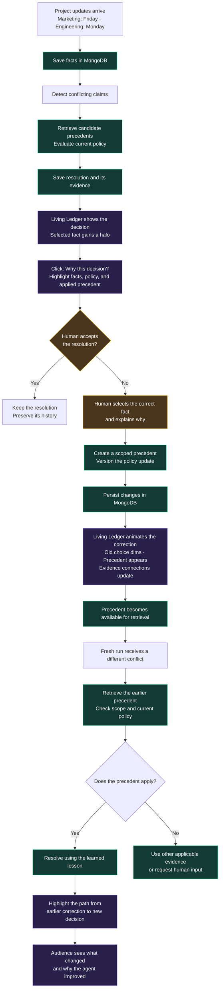

# Chronicle demo flow

The [user decision log](decisions.md) records how this design evolved. The current answer-first/replay flow supersedes automatic zooming on submission; the natural memo review supersedes an opening prompt that explicitly supplies both conflicting claims.

## One view, two presentation lengths

**First round: 60 seconds total. If the team reaches the top six: a five-minute demo.** These are the user's presentation requirements. Both use the same terminal, optional spatial replay, scenario, and underlying state. There is no short/long mode switch or second walkthrough.

After optional internal replay reveals the surrounding network, the scene keeps the core results and their relationship understandable: **initial decision → human correction and scoped lesson → improved decision on a different conflict in a fresh run.** Processes are represented compactly. Narration carries technical detail; optional inspections expose evidence and integrations when time allows.

The longer presentation gives the same story room to breathe. It can inspect evidence, discuss the stored lesson, and show the out-of-scope case without making those inspections prerequisites for understanding the one-minute demo. Full product scope and correctness checks remain unchanged.

## Main view and optional depth

- **Normal use:** plain Chronicle wordmark and a practical floating terminal that fills the available window between compact header/footer bars, with consistent padding, fixed 14px conversation text, named source selection, adjacent company/model dropdowns, scrolling Markdown conversation, and a prompt composer. No logo is defined; do not substitute a provider-like star symbol.
- **Conversation controls:** a compact chat picker and New chat create real browser-persisted conversations. Transcripts and model conversation history stay scoped to the selected chat; project facts, corrections, and policy remain shared. Older history migrates into the first chat. Switching preserves unsent text and attachments during the session. The toolbar sits below the typing area, with company/model dropdowns aligned right and the paperclip before From and the person’s name on the left; Use example memo sits beside Reset demo. Hide provider/model names and “Local rules” in reply metadata. Show “✓ Decision saved to memory” only for a completed turn with a recorded decision-save confirmation; during replay reveal it only once that confirmation is reached. Pending replies and failed saves must not show this status. The decision-save badge is reserved for explicit saved human answers/corrections (including leave-unresolved) and automatic conflict resolutions that apply a scoped lesson. Ordinary replies, greetings, acknowledgements, fact ingestion/lookups, and provisional choices awaiting review must not receive a decision badge merely because the conversation was persisted. Keep provider selection and technical replay inspection available. Omit keyboard hints. Use a subtle contrast increase for text, borders, and controls without changing the dark green palette. Textareas grow and shrink with their contents without resize handles, and scroll after a bounded height.
- **Start with a natural review:** Maya [Marketing] attaches a go-to-market memo and asks “Can you review this before I share it with the team?” The draft contains messaging, campaign assets, rollout details, and a Friday launch date. Chronicle notices that date while reviewing the full document, compares it with a readiness update from Alex [Engineering] learned earlier, and raises the discrepancy without requiring the user to name it. The Engineering source is dated September 18 in the example and expects Monday readiness. Example documents and seeded records remain identifiable.
- **Natural follow-up:** after the correction, attach Maya’s next-release brief for review. Its Tuesday announcement meets Alex’s separately seeded Thursday readiness gate from September 24 planning notes. The user never supplies both competing claims. Maya and Alex are fictional example teammates, with authors stored separately from department authority keys. Existing saved sessions retain their history; reset the local example to load the updated seed set.
- **Formatting and model selection:** render standard Markdown and GFM (bold, italics, lists, code, links, tables) in messages, including existing saved history and replay. Ignore raw HTML and remote image embeds. Company choices filter the model dropdown; OpenAI includes signed-in Codex and the API-key route, while Anthropic and Custom retain their connection settings. Switching companies remembers the prior model for that company during the session.
- **Repeated corrections and attribution:** Human conflict answers use the currently selected composer identity (for example Maya [Marketing]), separately from the selected fact’s author; never hardcode “You” or relabel old anonymous records. An explicit conflicting revision of an already decided subject (for example “actually the launch should be October 2”) saves the new claim and opens a fresh source-of-truth question even when a prior lesson applies. Calendar-only launch dates are supported. Keep the prior decision and policy history; save the new scoped choice only after an explicit answer. Simple lookups use the latest saved human answer without treating old disagreement as a new unresolved question.
- **Adaptive question eligibility:** Conflict questions adapt to the current request and its relevant recorded claims. Start chats and resets with an empty composer; load the demo document only through Use example memo. Automatically prompt only for the latest response in the active chat, never an older unanswered conflict after an unrelated reply. The real model returns an optional task-specific question with validated candidate fact IDs; unrelated requests get no question. Keep claim/source options grounded in stored evidence, retain manual reopening on the original response, and do not ask again when a saved human answer covers the same facts or a scoped lesson was applied. The local parser still has limited structured claim coverage; the connected Python engine decides among its stored candidate claims.
- **Direct conflict question:** once the current response requests a grounded conflict decision, temporarily replace the composer with a compact question card. Keep the existing draft text, attachments, and source cached; restore them unchanged after answering or skipping. It uses concise claim/source options, an always-visible Add context textbox, and an explicit Submit answer. Show context files sits above the options and opens an evidence panel upward without shifting the options. The context textbox grows with its text and is not hidden behind a dropdown. Keep navigation usable and return the normal composer afterward: no modal, backdrop, focus trap, or forced focus. No claim is preselected. Include Leave unresolved and Skip for now; deferring keeps a Resolve conflict action on that response. Persist the human answer linked to the original conflict and retain the old decision. A clearly labeled checkbox on an Engineering launch-readiness choice saves the project-scoped lesson; other choices apply to that conflict only. Human answers use the backend correction API without another model request. Completed answers survive reload; only the latest eligible unanswered response can prompt on reload; older questions stay on their original response. Replay never triggers a question.
- **Immediate send:** the submitted text and attachments appear in history and the composer clears before generation. A separate Chronicle reply indicator shows the wait and elapsed time; it never claims a completed or saved answer. The composer and attachment controls remain editable while the reply is pending, so the user can prepare the next message; sending another request waits for completion. Never clear that next draft when generation finishes. On failure, retain the recorded message and restore the submitted draft only if there is no newer text or attachment draft. Otherwise preserve the newer draft and leave the failed message in history.
- **Answer first:** the selected model returns the response while the terminal remains large and stationary. Do not force an animated presentation on each prompt.
- **Optional internal replay:** Show a single Replay internals action for the latest completed cycle in the active chat. A conflict cycle requiring human input is complete only after its human answer is saved; combine the original review and correction traces into that one replay. Pending, failed, and deferred conflict cycles have no replay action. The person selector contains only Maya [Marketing] and Alex [Engineering]. Do not show a “Review the next release brief” suggestion button; follow-up documents can still be attached normally. Replay zooms out and plays the combined recorded events without generating another answer or repeating writes. Pause, step, and return-to-terminal controls remain available.
- **Visible saves:** distinguish writing from write confirmation, and preserve the distinction between fact persistence and final decision/evidence persistence. Failed writes are not shown as saved.
- **Optional depth:** scoped policy, old facts, selected evidence, response history, and model/provider details live in the same terminal and revealed scene. No separate short/long presentation mode.

## User-directed spatial architecture

The terminal initially fills the available window with 20px side gutters (12px on small screens), a 52px header, and a compact status footer. Working-view typography does not grow with window dimensions; only the optional spatial replay scales. Submitting a prompt does **not** move the camera. The explicit replay button pulls back until the terminal occupies approximately one fifth of the visible scene; the overview keeps destinations clustered nearby with complete paths in view. Directed close views may frame only the active service and its immediate connections.

The replay uses one shared perspective camera and three depth layers: the foreground conversation, resolution/model execution, and persistent memory/retrieval underneath. After the presenter selects **Replay internals**, playback directs itself: the camera eases toward the relevant service, turns to reveal two underlying process sheets, holds across consecutive steps at the same service, and ends by flattening the shared scene before zooming the same terminal back to its working layout. The reference image informs the stacked-layer metaphor only; Chronicle is not showing a neural-network pipeline or private model reasoning. An unscaled **input → operation → output** caption explains each transformation while a teammate narrates. Pause, scrubbing, and **Replay step** remain available; Replay step restarts the selected visual beat and pauses there, including on the final event. Full autoplay returns to the terminal. Automatic camera following is the default, with no Auto camera/Explore camera selector. Drag exploration is secondary, and pressing Play restores the automatic camera and clears the manual pan. Depth is enabled by default without a user-facing toggle. System reduced-motion preferences remove perspective and skip the animated return. Cards and connection endpoints share world coordinates so camera movement cannot detach the wires. Service inspection pauses playback and opens unscaled details. Desktop demo rendering is the validation target; mobile support and mobile checks are not required. A larger 3D renderer is not installed.

The service stations show actual recorded operations. Atlas stores workspace snapshots (documents, facts, conversation, engine resolutions, corrections, policy history and replay traces) plus precedent embeddings in the separate `precedents` collection. Voyage embeds conflict queries and correction documents through Danny’s module; Atlas Vector Search returns project-filtered candidates and measured similarity scores. Elmir’s Python engine checks applicability and policy before selecting evidence. Only backend-confirmed operations mark those services as called. Service inspection accumulates receipts across the complete review/correction cycle, so entering the human-answer phase does not erase the earlier search. Receipts remain gated by packet arrival and disappear when scrubbing before their event. No-call explanations distinguish older browser-only recordings, reuse of a saved human answer, and recorded retrieval failure; ordinary messages do not need precedent retrieval. Browser claim extraction stays at the terminal; legacy traces retain their local meaning. No score, embedding, storage acknowledgment or route is inferred from the presence of a conflict. Receipts expose model, dimensions, input type, duration, candidate IDs/scores/scope, selected fact, applied precedent and policy changes. MongoDB Agent Skills/MCP remain development tools.

Service semantics checked against the [Voyage embedding documentation](https://docs.voyageai.com/docs/embeddings), [Atlas Vector Search query documentation](https://www.mongodb.com/docs/atlas/atlas-vector-search/vector-search-stage/), and [MongoDB MCP overview](https://www.mongodb.com/docs/mcp-server/overview/). The supplied planning document controls the team’s integration responsibilities.

Replay follows the actual recorded application sequence:

1. Receive Marketing’s review request and attached memo.
2. Save the original document, filename, and source; confirm the write.
3. Read the memo for factual claims, including the incidental launch date; save those claims with document provenance.
4. Look up prior project evidence and compare the new claim to the older Engineering update.
5. Check policy and precedent scope; identify evidence actually applied.
6. Send the complete memo, review request, and relevant context to the selected model; receive a natural document review that flags the mismatch.
7. Save the response, explanation, and evidence; confirm the write.
8. Return the review to the terminal. Only an explicit replay action reveals these steps.

Glowing packets travel between the corresponding stations. Saving has its own route and confirmation; it must not be collapsed into an unexplained “memory” pulse. Transfers use the original one-second route pace. On arrival, one dot descends through the service layers and rises back to the surface over at least 2.4 seconds. Consecutive service operations and save confirmations retain their own captions while continuing that same round trip at its current position. The next transfer starts as the ascent finishes, without an idle hold or duplicate pass. Use one persistent dot across wire and stack phases. Teleport from the wire endpoint to a fixed stack corner, bounce down and back up that lane, and teleport onto the next route without a diagonal connecting flight. Each 250 ms teleport beat fades out for 125 ms, changes position at zero opacity, and fades back in for 125 ms. There is no visibly frozen hold; this is presentation timing, not a fabricated service event. The camera preserves velocity across changing service destinations, with a steadier angle and gentler zoom. Teleports and caption changes do not restart camera motion. Flattening back into the terminal also eases gradually. Only one incoming connection carries the moving dot; other context connections can remain highlighted. Pause/resume, scrub, and Replay step retain the relevant slice of this shared motion timeline. Drive packet motion and step advancement from one playback clock; caption changes must not restart the first part of a transfer or bounce. Combine a write request, backend receipt, and confirmation into one visible save step while retaining their original events and order. Keep one bounce across consecutive operations at a service. Local terminal captions continue the incoming transfer without an in-chat bounce, processing delay, or camera return; retain the last service camera until the next service, then flatten back into the terminal at the end. Use the same layer offsets for packet motion and sheet depth, with only 2 px clearance outside the sheet edge. Turn the bounce slightly before the lowest sheet (80% of the full descent) so the packet glow does not visibly overshoot; preserve playback timing. Derive each visible connection from the preceding and destination stations; route the engine-to-Voyage connection around the model card. Keep the dot outside sheet edges so upper layers cannot hide it. Reveal service results when the packet arrives, and the answer when replay returns it. Identify older browser-only recordings and explain that a new conflict is needed to capture connected Voyage calls. Replay preserves recorded event order and timestamps; it is not live provider latency or a view into private model reasoning. New model calls capture a credential-free request receipt at the server boundary: prompt, attachment names and sizes, history references, fact/note IDs, policy version, selected evidence, provider, model, and transport. Replay shows the returned character count and measured duration. Older turns say when their request details were not captured; do not reconstruct them from current memory. Future backend events must supply their actual service, operation, input/output summaries, and evidence, using the agreed integration contract.

New prompts can be arbitrary text. The selected real model supplies general responses. The browser adapter extracts a limited set of structured claims. The Python engine decides conflicts using Atlas-backed policy and Danny’s candidate retrieval. The full document reaches the selected response model. This does not establish general-purpose fact extraction.

The user authorized Codex through their existing sign-in for the demo, plus a provider/model selector and API-key connections for OpenAI, Claude, and compatible providers. Keys stay only in the local server's memory. Actual service status distinguishes recorded provider calls, Atlas acknowledgments, backend-memory fallback when no URI is configured, and services not called in that turn.

## Suggested 60-second sequence

Use the main view throughout. No setup screens, long typing, or navigation tour. Start with older Engineering context already in memory and Marketing’s attached launch memo in the terminal. The user asks for a review, not for a comparison of two supplied dates. Get the answer first, then correct the source authority. The saved correction unlocks one combined internal replay; keep full playback optional for the longer presentation. Introduce the next release while retaining the lesson. Rehearse live model latency before promising a 60-second run.

| Time | Focus on the same view | Narration / action |
| --- | --- | --- |
| 0–12 s | Marketing submits a memo for review | Save the document and notice its Friday date conflicts with Engineering’s earlier Monday readiness update. |
| 12–28 s | Review the detected conflict and correct authority | Answer the conflict question with Engineering’s claim and retain the scoped launch-readiness lesson. |
| 28–40 s | Corrected result and learned lesson; policy v1 → v2 | Explain that the correction becomes persistent project memory. Wait for confirmed persistence and retrieval readiness. |
| 40–53 s | Different release, fresh run: Tuesday versus Thursday | Introduce the new conflict. Show Thursday selected using the earlier lesson. |
| 53–60 s | Visible connection from correction to later decision | Close on changed behavior and traceable evidence. |

Working voiceover (about 100 words; rehearse with actual operation timings):

> Teams change their plans. Their agents should remember why. Marketing uploads a launch memo for review. Chronicle notices the Friday rollout conflicts with an older Engineering update that says Monday. Its starting policy prioritizes Marketing. I correct it: Engineering owns launch readiness for this project. The correction becomes a scoped lesson, with a new policy version and the earlier decision preserved. Now Maya brings another release brief. Chronicle catches a different mismatch against Alex’s earlier planning notes. Chronicle uses the earlier lesson and chooses Thursday. This link shows exactly which correction changed the decision. Chronicle is self-healing project memory: human feedback changes future behavior, and every decision keeps its evidence.

The service loop has been verified against Atlas/Voyage; the complete narrated presentation still needs timing and rehearsal. Timings are targets, not permission to fabricate completed operations. If latency prevents a reliable one-minute run, use a clearly identified recording of a successful real run. Do not hide failures behind animation or label a placeholder as saved.

## Suggested five-minute sequence

Use the same terminal and revealed network, pausing to explain the visible claims and paths. Optional session history stays inside the terminal; close it before the next demonstration beat. Leave short pauses for the audience to absorb the correction and reuse results.

| Time | On-screen focus | Additional depth |
| --- | --- | --- |
| 0:00–0:35 | Enlarged terminal; submit Marketing’s memo and receive the answer | Establish the stored Engineering claim and the new conflicting fact. |
| 0:35–1:15 | Terminal correction and saved project lesson | Answer the conflict question with Engineering’s claim and the scoped launch-readiness lesson. Confirm the saved answer and policy v2. |
| 1:15–2:10 | Select the single Replay internals action on the completed cycle | Follow the original fact write, evidence lookup, policy v1, model request, and resolution into the saved human correction and policy v2. |
| 2:10–3:15 | New-release prompt and illuminated memory route | Follow the lesson into the Thursday decision; explain what survives a fresh run in the intended live system. |
| 3:15–4:00 | Same network; optional terminal history | Compare the earlier decision and corrected outcome. Discuss why launch-readiness authority does not imply budget authority. The local rule adapter leaves conflicting budget claims unresolved; arbitrary prompts still reach the selected model. |
| 4:00–4:35 | Same compact scene | Inspect recorded Atlas/Voyage/search/engine receipts, distinguishing candidates from applied precedents. |
| 4:35–5:00 | Completed reuse path | Close on the earlier correction and the different decision it influenced. |

These intervals include interaction and transitions. The longer slot is not a requirement to fill the screen with controls or demonstrate every feature. Live operations determine status; pauses do not simulate completion.

## Canonical flowchart

The diagram below preserves the user-supplied logical flow, with whitespace and ` ` escapes normalized for Mermaid rendering. Its two-claim opening is historical shorthand: the current UI receives Marketing’s memo and discovers the Engineering claim in older memory, as specified above. The diagram is not a requirement to expose both claims in the initial prompt or animate before the answer. The one-minute note is captured above rather than embedded in diagram syntax.

## Frontend interpretation

- The terminal answer and nearby nodes expose source facts, policy version, and the applied lesson in the local prototype. A live implementation must display the actual backend explanation and trace.
- Fact colors identify sources. Conflict edges, selected-fact halos, and precedent connections convey state.
- Correction motion follows actual persisted events: supersede the prior selection, introduce the precedent, and update evidence connections.
- The later resolution visibly links to the earlier correction. A retrieved but unused precedent must not be presented as an applied lesson.
- The first-round path should remain understandable without exploring every panel or graph node.
- The prototype uses CSS camera scaling, shallow perspective, and shared 3D wire segments to replay recorded events. Full 3D remains future work.

## Current prototype boundary

The app runs locally with real Atlas, Voyage, Vector Search, Python-engine and model calls. Start `npm run backend` (Python on 127.0.0.1:8000) and `npm run dev` (Vite). Resolution and learning use `/state` and `/state/correct`, both with `context.scope` and `context.subject`; workspace load/save use `/api/ledger/*`; the retired `backend/app.py` is not restored; the canonical application is `app.main:app`. Credentials are in ignored server-only `.env`; provider API keys remain in the Node bridge’s memory. Static preview has neither backend nor model bridge.

Atlas `workspaces` snapshots preserve original documents before extracted facts, conversations, recorded resolutions, linked human decisions, prior policy versions and traces. `precedents` holds Voyage document embeddings. Only precedent IDs committed to the workspace may be supplied to the engine. The explicit Engineering readiness checkbox produces a project/domain-scoped lesson covering later releases; other selections and leave-unresolved decisions do not create authority rules. Correction retries are idempotent. Search readiness is checked against the actual index, with pending status if not yet visible. A new workspace ID isolates Reset demo without deleting other team data or old runs. Browser storage caches the selected workspace and UI history.

The browser still performs limited date/structured-claim extraction and comparison. It does not impersonate Python execution in replay. Ordinary prompts get a real selected-model answer without unnecessary retrieval. The example memo and earlier Engineering claims stay labeled as example records. Documents are plain text/Markdown up to 100 KB. Source dates, authors, department keys and fact IDs are retained.

Codex uses the user’s signed-in CLI through the existing read-only text bridge; other provider adapters still need live verification. Model receipts include actual request context and response timing. The frontend consumes backend receipts returned per request, not a live event stream. Replay only reads those stored traces, animates real paths, and never repeats persistence, embedding, search or generation.

Verified live: Atlas connection, Voyage `voyage-4` with 1,024 dimensions, `precedent_vector_index` with a project filter, Friday initially selected, a saved Engineering correction creating policy v2, actual indexed retrieval of that correction selecting Thursday for the next release, out-of-scope budget abstention, and policy/lesson/transcript persistence after backend restart. The service smoke test uses a clearly labeled stub model; browser QA separately exercises the actual Codex response. The localhost integration is not yet a multi-user hosted system, and one-minute timing still needs rehearsal.

## Research informing the structure

Research checked September 26, 2026. The following are observed patterns plus our design inferences, not evidence that a particular interface caused an award. Sources were read as articles, documentation, and an extracted video transcript; no claim is made to have watched the complete videos.

| Example | Verified recognition / observed pattern | Application to Chronicle (our inference) |
| --- | --- | --- |
| Flighty | [Apple Design Awards 2023, Interaction winner](https://developer.apple.com/design/awards/2023/). Apple's [Behind the Design](https://developer.apple.com/news/?id=970ncww4) describes keeping essential information visible and using familiar airport conventions. | Keep the decision, scope, and learned lesson readable in a stable location while details change. |
| Shapr3D | [Apple Design Award winner, 2020](https://www.apple.com/newsroom/2020/06/apple-honors-eight-developers-with-annual-apple-design-awards/). Its [adaptive interface documentation](https://support.shapr3d.com/hc/en-us/articles/7873882619548-Adaptive-user-interface) describes tools suggested by the current selection. This documentation describes the product pattern, not necessarily its exact 2020 implementation. | Selecting a decision or lesson should expose relevant evidence beside the ledger. Avoid a permanently expanded technical control surface. |
| Salva Health | [Startup Battlefield winner, Disrupt 2024](https://techcrunch.com/2024/10/30/and-the-winner-of-startup-battlefield-at-disrupt-2024-is-salva-health/). In the [finalist pitch transcript](https://www.youtube.com/watch?v=voq2bdebang), the team starts a real screening, presents while it runs, then returns to the result. | Use the natural wait for persistence/retrieval to explain value, then focus attention on the confirmed result. Its healthcare workflow is not a visual template for Chronicle. |

[NN/g's progressive disclosure guidance](https://www.nngroup.com/articles/progressive-disclosure/) supports showing core information first and making advanced detail accessible on request. For Chronicle, keep those disclosures within the same view. [YC's presentation guide](https://www.ycombinator.com/blog/guide-to-demo-day-pitches/) recommends a small number of memorable points and rehearsal; our three outcomes are decision, correction, and reuse. Neither is an award example.

The short presentation should communicate the full value without opening details. The longer presentation earns confidence by inspecting how that same result happened. Actual timing and legibility still require rehearsal on the presentation display.

### Runtime contract

The question card posts its saved human decision to `/state/correct`, with the conflict’s `scope` and `subject` in `context`. `/override` stores a note only and must never drive the learning demonstration. `/state` retrieves once through Sahil’s orchestration and Danny’s adapter, then supplies candidates to Elmir’s adapter. See [INTEGRATION.md](../INTEGRATION.md) for the exact generic and durable-workspace payloads. The backend exposes an SSE `/events` endpoint for its generic repository; replay continues to consume completed request receipts.
