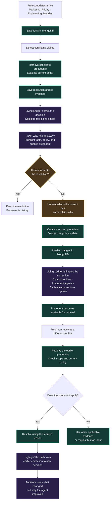

# Chronicle demo flow

The [user decision log](decisions.md) records how this design evolved. The current answer-first/replay flow supersedes automatic zooming on submission; the natural memo review supersedes an opening prompt that explicitly supplies both conflicting claims.

## One view, two presentation lengths

**First round: 60 seconds total. If the team reaches the top six: a five-minute demo.** These are the user's presentation requirements. Both use the same terminal, optional spatial replay, scenario, and underlying state. There is no short/long mode switch or second walkthrough.

After optional internal replay reveals the surrounding network, the scene keeps the core results and their relationship understandable: **initial decision → human correction and scoped lesson → improved decision on a different conflict in a fresh run.** Processes are represented compactly. Narration carries technical detail; optional inspections expose evidence and integrations when time allows.

The longer presentation gives the same story room to breathe. It can inspect evidence, discuss the stored lesson, and show the out-of-scope case without making those inspections prerequisites for understanding the one-minute demo. Full product scope and correctness checks remain unchanged.

## Main view and optional depth

- **Normal use:** plain Chronicle wordmark and a practical floating terminal with consistent padding, source selection, model selection, scrolling conversation, and a prompt composer. No logo is defined; do not substitute a provider-like star symbol.
- **Start with a natural review:** Marketing attaches a go-to-market memo and asks “Can you review this before I share it with the team?” The draft contains messaging, campaign assets, rollout details, and a Friday launch date. Chronicle notices that date while reviewing the full document, compares it with an Engineering readiness update learned earlier, and raises the discrepancy without requiring the user to name it. The Engineering source is dated September 18 in the example and expects Monday readiness. Example documents and seeded records remain identifiable.
- **Answer first:** the selected model returns the response while the terminal remains large and stationary. Do not force an animated presentation on each prompt.
- **Optional internal replay:** the completed response has a Replay internals button. This zooms out and plays its recorded events without generating another answer or writing the same fact twice. Pause, step, and return-to-terminal controls remain available.
- **Visible saves:** distinguish writing from write confirmation, and preserve the distinction between fact persistence and final decision/evidence persistence. Failed writes are not shown as saved.
- **Optional depth:** scoped policy, old facts, selected evidence, response history, and model/provider details live in the same terminal and revealed scene. No separate short/long presentation mode.

## User-directed spatial architecture

The terminal initially fills most of the view. Submitting a prompt does **not** move the camera. The explicit replay button pulls back until the terminal occupies approximately one fifth of the visible scene; all destinations stay clustered nearby with complete paths in view.

The spatial layers are a local store, recall/comparison, policy/precedents, and model/decision execution around a foreground terminal. Shallow perspective, offset planes, edge thickness, and shadows distinguish depth while keeping labels readable. A larger 3D renderer is not installed.

Replay follows the actual recorded application sequence:

1. Receive Marketing’s review request and attached memo.
2. Save the original document, filename, and source; confirm the write.
3. Read the memo for factual claims, including the incidental launch date; save those claims with document provenance.
4. Look up prior project evidence and compare the new claim to the older Engineering update.
5. Check policy and precedent scope; identify evidence actually applied.
6. Send the complete memo, review request, and relevant context to the selected model; receive a natural document review that flags the mismatch.
7. Save the response, explanation, and evidence; confirm the write.
8. Return the review to the terminal. Only an explicit replay action reveals these steps.

Glowing packets travel between the corresponding stations. Saving has its own route and confirmation; it must not be collapsed into an unexplained “memory” pulse. Replay uses slower visual timing for legibility, with real event order and recorded timestamps; it is not live provider latency or a view into private model reasoning.

New prompts can be arbitrary text. The selected real model supplies general responses. The temporary local adapter extracts a limited set of structured claims and applies simple scoped demo rules; it is not a claim of production-grade fact extraction or conflict resolution. Update each internal operation as real services and the team's contracts become available.

The user authorized Codex through their existing sign-in for the demo, plus a provider/model selector and API-key connections for OpenAI, Claude, and compatible providers. Keys stay only in the local server's memory. Actual service status must distinguish live Codex generation, browser-local storage, and still-unconnected Atlas/Voyage services.

## Suggested 60-second sequence

Use the main view throughout. No setup screens, long typing, or navigation tour. Start with older Engineering context already in memory and Marketing’s attached launch memo in the terminal. The user asks for a review, not for a comparison of two supplied dates. Get the answer first, then replay its internals. Correct the source authority and introduce the next release while retaining the lesson. Rehearse live model latency before promising a 60-second run.

| Time | Focus on the same view | Narration / action |
| --- | --- | --- |
| 0–12 s | Marketing submits a memo for review | Save the document and notice its Friday date conflicts with Engineering’s earlier Monday readiness update. |
| 12–28 s | Replay the first answer, then correct authority | Show the confirmed fact write and conflict; return to the terminal and submit “Engineering owns launch readiness for this project.” |
| 28–40 s | Corrected result and learned lesson; policy v1 → v2 | Explain that the correction becomes persistent project memory. Wait for confirmed persistence and retrieval readiness. |
| 40–53 s | Different release, fresh run: Tuesday versus Thursday | Introduce the new conflict. Show Thursday selected using the earlier lesson. |
| 53–60 s | Visible connection from correction to later decision | Close on changed behavior and traceable evidence. |

Working voiceover (about 100 words; rehearse with actual operation timings):

> Teams change their plans. Their agents should remember why. Marketing uploads a launch memo for review. Chronicle notices the Friday rollout conflicts with an older Engineering update that says Monday. Its starting policy prioritizes Marketing. I correct it: Engineering owns launch readiness for this project. The correction becomes a scoped lesson, with a new policy version and the earlier decision preserved. Now a fresh run gets a different release: Marketing says Tuesday; Engineering says Thursday. Chronicle uses the earlier lesson and chooses Thursday. This link shows exactly which correction changed the decision. Chronicle is self-healing project memory: human feedback changes future behavior, and every decision keeps its evidence.

This is a script for a verified working loop, not a claim of completed Atlas/Voyage integration in the local prototype. Timings are targets, not permission to fabricate completed operations. If latency prevents a reliable one-minute run, use a clearly identified recording of a successful real run. Do not hide failures behind animation or label a placeholder as saved.

## Suggested five-minute sequence

Use the same terminal and revealed network, pausing to explain the visible claims and paths. Optional session history stays inside the terminal; close it before the next demonstration beat. Leave short pauses for the audience to absorb the correction and reuse results.

| Time | On-screen focus | Additional depth |
| --- | --- | --- |
| 0:00–0:35 | Enlarged terminal; submit Marketing’s memo and receive the answer | Establish the stored Engineering claim and the new conflicting fact. |
| 0:35–1:15 | Select Replay internals on the Friday response | Show the fact write, save confirmation, stored evidence, policy v1, model request, and saved resolution. |
| 1:15–2:10 | Terminal correction and nearby project memory | Select the prepared correction, submit it, and follow its path into a scoped lesson and policy v2. |
| 2:10–3:15 | New-release prompt and illuminated memory route | Follow the lesson into the Thursday decision; explain what survives a fresh run in the intended live system. |
| 3:15–4:00 | Same network; optional terminal history | Compare the earlier decision and corrected outcome. Discuss why launch-readiness authority does not imply budget authority. The local rule adapter leaves conflicting budget claims unresolved; arbitrary prompts still reach the selected model. |
| 4:00–4:35 | Same compact scene | Explain the intended Atlas, Voyage, and engine responsibilities. The mockup does not show them as connected. |
| 4:35–5:00 | Completed reuse path | Close on the earlier correction and the different decision it influenced. |

These intervals include interaction and transitions. The longer slot is not a requirement to fill the screen with controls or demonstrate every feature. Live operations determine status; pauses do not simulate completion.

## Canonical flowchart

The diagram below preserves the user-supplied logical flow, with whitespace and ` ` escapes normalized for Mermaid rendering. Its two-claim opening is historical shorthand: the current UI receives Marketing’s memo and discovers the Engineering claim in older memory, as specified above. The diagram is not a requirement to expose both claims in the initial prompt or animate before the answer. The one-minute note is captured above rather than embedded in diagram syntax.

## Frontend interpretation

- The terminal answer and nearby nodes expose source facts, policy version, and the applied lesson in the local prototype. A live implementation must display the actual backend explanation and trace.
- Fact colors identify sources. Conflict edges, selected-fact halos, and precedent connections convey state.
- Correction motion follows actual persisted events: supersede the prior selection, introduce the precedent, and update evidence connections.
- The later resolution visibly links to the earlier correction. A retrieved but unused precedent must not be presented as an applied lesson.
- The first-round path should remain understandable without exploring every panel or graph node.
- The prototype uses CSS camera scaling, shallow perspective, and SVG paths to replay recorded events. Full 3D remains future work.

## Current prototype boundary

The current app is a **working local demonstration**, not the integrated MVP. Browser storage persists facts, unstructured notes, conversation, scoped corrections, and recorded traces across reloads. Marketing can upload a natural memo and receive a review that discovers a conflict with previously stored Engineering evidence. The original memo is saved before extracted claims; source document names and dates remain attached to evidence. Plain-text and Markdown uploads up to 100 KB are supported, with a clearly labeled example memo provided. Questions are recorded as messages, not promoted to facts. A later launch release can reuse the saved local lesson; budget disagreements do not inherit launch authority.

The terminal accepts arbitrary prompts through real model generation. Codex uses the user's installed CLI and existing ChatGPT sign-in through a localhost-only server bridge; it has been tested live. OpenAI Responses, Anthropic Messages, and custom OpenAI-compatible Chat Completions are implemented as adapters but require user API keys and live verification. A key connection is not proof that a provider/model call succeeded.

The terminal remains stationary for prompt/response use. Replay internals reads completed trace data, zooms out, and animates its sequence. It does not rerun the model or duplicate writes. Reset clears only this demo's local records and restores the seeded example. Provider keys are held in server memory until restart, never in localStorage or the repository.

Elmir’s standalone engine and tests are available in `resolution-engine/` after the GitHub sync. They are not yet connected to the terminal.

`src/memory.js` is a provisional local demo adapter; it does not replace the team's production engine or retrieval work. Atlas persistence, Voyage embeddings, Vector Search, server event streaming, and the agreed production contract remain unconnected. The intended MVP still requires those integrations. Subsequent user-supplied service details should replace the corresponding local representation rather than create competing specifications.

The model bridge is available through `npm run dev`; a static production build does not run it. See [the README](../README.md) for connection instructions and implementation references.

## Research informing the structure

Research checked September 26, 2026. The following are observed patterns plus our design inferences, not evidence that a particular interface caused an award. Sources were read as articles, documentation, and an extracted video transcript; no claim is made to have watched the complete videos.

| Example | Verified recognition / observed pattern | Application to Chronicle (our inference) |
| --- | --- | --- |
| Flighty | [Apple Design Awards 2023, Interaction winner](https://developer.apple.com/design/awards/2023/). Apple's [Behind the Design](https://developer.apple.com/news/?id=970ncww4) describes keeping essential information visible and using familiar airport conventions. | Keep the decision, scope, and learned lesson readable in a stable location while details change. |
| Shapr3D | [Apple Design Award winner, 2020](https://www.apple.com/newsroom/2020/06/apple-honors-eight-developers-with-annual-apple-design-awards/). Its [adaptive interface documentation](https://support.shapr3d.com/hc/en-us/articles/7873882619548-Adaptive-user-interface) describes tools suggested by the current selection. This documentation describes the product pattern, not necessarily its exact 2020 implementation. | Selecting a decision or lesson should expose relevant evidence beside the ledger. Avoid a permanently expanded technical control surface. |
| Salva Health | [Startup Battlefield winner, Disrupt 2024](https://techcrunch.com/2024/10/30/and-the-winner-of-startup-battlefield-at-disrupt-2024-is-salva-health/). In the [finalist pitch transcript](https://www.youtube.com/watch?v=voq2bdebang), the team starts a real screening, presents while it runs, then returns to the result. | Use the natural wait for persistence/retrieval to explain value, then focus attention on the confirmed result. Its healthcare workflow is not a visual template for Chronicle. |

[NN/g's progressive disclosure guidance](https://www.nngroup.com/articles/progressive-disclosure/) supports showing core information first and making advanced detail accessible on request. For Chronicle, keep those disclosures within the same view. [YC's presentation guide](https://www.ycombinator.com/blog/guide-to-demo-day-pitches/) recommends a small number of memorable points and rehearsal; our three outcomes are decision, correction, and reuse. Neither is an award example.

The short presentation should communicate the full value without opening details. The longer presentation earns confidence by inspecting how that same result happened. Actual timing and legibility still require rehearsal on the presentation display.
